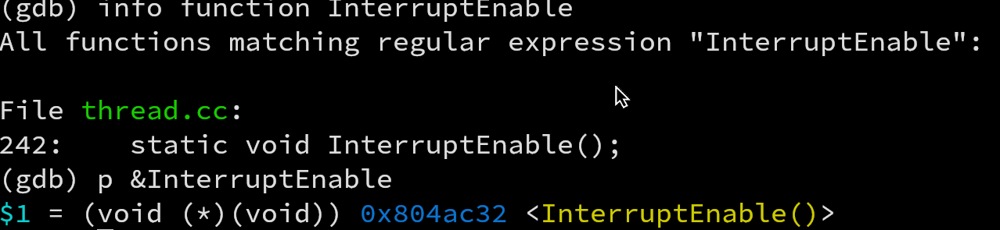
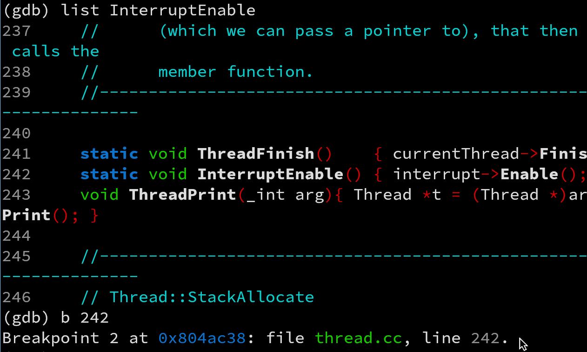
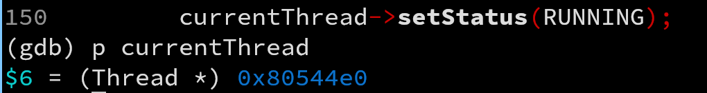
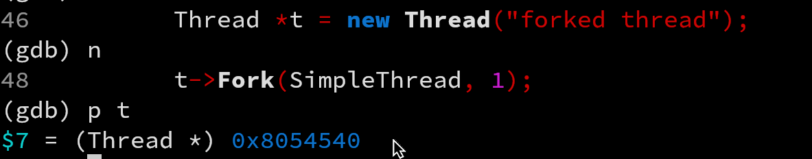
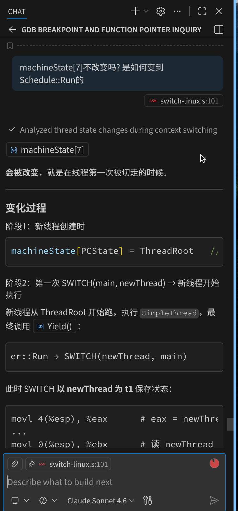

# 概览

# 实验一（Nachos 系统的安装与调试）

## 任务要求

1. 安装 Linux 操作系统；

2. 安装 Nachos 及 gcc mips 交叉编译程序；

3. 编译测试 Nacho，并理解 Nachos 的运行参数的含义与使用；

4. 运行 Nachos，根据 Nachos 的输出，理解 Nachos 中第一个线程是如何产生的。
   理解并掌握 Nachos 中其它内核线程的创建方法；理解 idle 线程的创建与作用。
   进而理解一个实际的操作系统（如 Windows、Linux 等）的第一个进程是如何产生的，
   以及 ideler 进程的创建与使用。

5. 理解 Nachos 中的上下文切换过程；

6. 熟悉 gdb 调试工具；

7. 当启动 Nachos 时，首先运行的程序模块是 code/threads/main.cc 程序。每一个子目录中也有相应的 main.cc 程序（目前目录 code/filesys 及 code/userprog 中使用的是 code/threads 中的 main.cc）。

   从 code/threads 目录下的 main.cc 开始，阅读、分析 Nachos 的.cc 源文件及相关
   的头文件，理解 Nachos 内核、线程的工作机理:

   （1）Nachos 的启动过程，Nachos 的内核加载和初始化过程；
   （2）Nachos 的命令行参数及其处理方法
   （3）Nachos 的第一个线程--主线程（main）是如何创建的？
   （4）如何创建线程：主线程线程是如何创建另一个线程并在该线程中执行函数
   SimpleThread(int which) （该函数在 code/threads/threadtest.cc 中）。
   （5）Nachos 是如何进行上下文切换的；
   主要代码：
   ../threads/main.cc
   ../threads/system.cc（.h）
   ../threads/thread.cc（.h）
   ../threads/scheduler.cc（.h）
   ../threads/switch-linux.s

## 实验过程

### 安装Nachos

我的环境是NixOS 26.05.202, 内核6.19.3. 我使用Flake构建了虚拟FHS沙盒来运行NachOS, 通过flake.nix[^1]可完整复现我的NachOS环境. 

[^ 1 ]: flake.nix完整内容见附录; 提交实验源代码时, 我将使用Ubuntu 22.04重新编译测试我的源代码. 

在初始的空FHS环境中, 我引入了如下包: 

- `gnumake`: 提供make工具驱动构建过程
- `gcc_multi`: 供NachOS内核编译的编译工具链, 支持32位目标平台, 并提供libstdc++等32位C++运行库
- `binutils`: 由gcc_multi的依赖引入, 提供链接器ld汇编器as等
- `glibc.dev`: 64位C标准库
- `pkgsi686Linux.glibc`: 32位C标准库
- `pkgsi686Linux.glibc.dev`: 32位C标准库头文件

除此之外, 我还提供了

- `zlib`: 压缩库
- `bear`: 提供compile_commands.json来辅助IDE进行高亮
- `ncurses`: 终端模拟库

应对NachOS的路径依赖, 我创建了如下软链接: 

- `/usr/lib64/cpp -> /usr/bin/cpp` 这是因为`Makefile.dep`中指定`CPP=/lib/cpp`, 而`/lib`默认是指向`/usr/lib64`的软链接
- `/usr/local/mips -> gcc-2.8.1-mips/mips` 提供目标平台为mips的交叉编译编译器

最后, 我按照`OS课程设计指南(C++)（2024）`进行了64位移植. 除了指南要求的修改外, 我在Makefile.common和Makefile.dep中分别对`CFLAGS`和`LDFLAGS`分别增加了`-fno-pie`和`-no-pie`以禁止虚拟空间下的重定位, 来展示真实的虚拟空间地址. 

### gcc MIPS 交叉编译器的安装与测试

gcc MIPS 交叉编译器安装在上一节已通过软链接完成, 接下来进行测试: 

进入`code/test`, 输入`make clean && make`

得到输出: 

```shell
../bin/arch/unknown-i386-linux/bin/coff2flat arch/unknown-i386-linux/objects/sort.coff arch/unknown-i386-linux/bin/sort.flat
Loading 3 sections:
	".text", filepos 0xd0, mempos 0x0, size 0x2c0
	".data", filepos 0x390, mempos 0x2c0, size 0x0
	".bss", filepos 0x0, mempos 0x2c0, size 0x1000
Adding stack of size: 1024
ln -sf arch/unknown-i386-linux/bin/sort.flat sort.flat
```

---

**思考** 为什么 nachos-3.4.tar.gz 一定要安装在/usr/local 目录中？

在Makefile.common中生效的部分: 

```makefile
ifeq ($(uname),Linux)
HOST_LINUX=-linux
HOST = -DHOST_i386 -DHOST_LINUX
CPP=/lib/cpp
CPPFLAGS = $(INCDIR) -D HOST_i386 -D HOST_LINUX
arch = unknown-i386-linux
ifdef MAKEFILE_TEST
#GCCDIR = /usr/local/nachos/bin/decstation-ultrix-
GCCDIR = /usr/local/mips/bin/decstation-ultrix-
LDFLAGS = -T script -N
ASFLAGS = -mips2
else
LDFLAGS = -no-pie # 我加的
endif
endif
```

可见其指定了预处理, 链接, 和编译部分的工具链各部分路径, 其中可看到

`GCCDIR = /usr/local/mips/bin/decstation-ultrix-`, 这个前缀会被拼接上具体的工具名, 见`Makefile`

```Makefile
CC = $(GCCDIR)gcc      # → /usr/local/mips/bin/decstation-ultrix-gcc
AS = $(GCCDIR)as       # → /usr/local/mips/bin/decstation-ultrix-as
LD = $(GCCDIR)ld       # → /usr/local/mips/bin/decstation-ultrix-ld
```

---

### 测试NachOS

遇到的问题: 若直接删掉输出目录`code/threads/arch/unknown-i386-linux`, 会报错:

```
>>> Building dependency file for  main.cc <<<
sh: line 2: arch/unknown-i386-linux/depends/main.d: No such file or directory
../Makefile.common:166: arch/unknown-i386-linux/depends/main.d: No such file or directory
make: *** [../Makefile.common:142: arch/unknown-i386-linux/depends/main.d] Error 1
```

这是因为`> $@` 重定向时, shell 要求 `arch/unknown-i386-linux/depends/` 必须已经存在, 否则报错. 

所以, 我修改了Makefile.common, 添加了对目录的顺序依赖`$(bin_dir)/% : | $(bin_dir)`, 并添加构建这些目录的目标:

```makefile
$(obj_dir) $(bin_dir) $(depends_dir):
	mkdir -p $@
```

成功获得内核: 

```shell
>>> Linking arch/unknown-i386-linux/bin/nachos <<<
g++ -m32  arch/unknown-i386-linux/objects/main.o 
...
/nix/store/9nmzd62x45ayp4vmswvn6z45h6bzrsla-binutils-2.44/bin/ld: NOTE: This behaviour is deprecated and will be removed in a future version of the linker
ln -sf arch/unknown-i386-linux/bin/nachos nachos
```

尝试运行NachOS: 

```shell
*** thread 0 looped 0 times
*** thread 1 looped 0 times
*** thread 0 looped 1 times
*** thread 1 looped 1 times
*** thread 0 looped 2 times
*** thread 1 looped 2 times
*** thread 0 looped 3 times
*** thread 1 looped 3 times
*** thread 0 looped 4 times
*** thread 1 looped 4 times
No threads ready or runnable, and no pending interrupts.
Assuming the program completed.
Machine halting!

Ticks: total 130, idle 0, system 130, user 0
Disk I/O: reads 0, writes 0
Console I/O: reads 0, writes 0
Paging: faults 0
Network I/O: packets received 0, sent 0

Cleaning up...
```

**分析输出结果**

(1) 初始化Nachos的设备和内核

我观察了`Initialize`函数, 由于在`code/threads`中只定义了`THREADS`宏, 所以其主要工作如下:

- 解析参数, 遍历argv列表. 在宏`THREADS`下(下略), 只解析-d和-rs参数(这段遍历十分优雅)

   `for (argc--, argv++; argc > 0; argc -= argCount, argv += argCount)` 

- 初始化了: debug消息 `DebugInit(debugArgs);   `

- 统计 `stats = new Statistics();`

- 中断控制器 `interrupt = new Interrupt;`

- 调度器 `scheduler = new Scheduler();    `

- 若开启-rs, 则开启随机抢占定时器 `timer = new Timer(TimerInterruptHandler, 0, randomYield);`

- 创建`main`线程. 这是为了当就绪队列没有东西时, 有东西作为`currentThread` 

  ```C++
      currentThread = new Thread("main");		
      currentThread->setStatus(RUNNING);
  ```

- 开中断 `interrupt->Enable();`, 实际上就是`SetLevel(IntOn); `

---

**讨论** main进程创建后, 后续的进程是如何创建的?

答案是通过`Thread::Fork`. 从`main.cc`的`ThreadTest()`可管中窥豹. 

先创建一个`Thread`对象, 初始化各字段, 接着调用了该对象的`Fork`方法. 

`Fork`方法内部则为线程分配了栈指针(`stack = (int *) AllocBoundedArray(StackSize * sizeof(_int));`)和栈顶(`stackTop = stack + StackSize - 4;`), 然后设置线程寄存器等. 

---

(2) 对Nachos内核进行测试

main创建了子线程, main线程和子线程分别执行`Simple(0)`, `Simple(1)`, 因为`SimpleThread`调用`Thread::Yield()`所以两个线程协作, 交替执行, 输出结果.

(3) 测试Nachos锁机制

设置`#if 1`, 执行`SynchTest()`. 输出

```shell
Direction [0], Car [0], Arriving...
Direction [0], Car [1], Arriving...
...
Direction [0], Car [6], Crossing...
Direction [0], Car [6], Exiting...
```

`SynchTest()`是一个过桥问题实例. 桥最多走3辆车, 且方向必须相同. 这里定义有7辆车, 故启动了7个线程, 每个线程代表一辆车的行为: 来回过5次桥. 每当车`Arriving`时, 会检查现在的方向和车辆数. 如果数量大于3或者方向不是自己的方向就会等待(虽然不是这个实例, 但这个策略在单方向车较多时容易导致饥饿), 用的是条件变量实现, 用的是mesa的monitor语义(也是上学期主要讲的条件变量用法). 

(4) 处理Nachos其他的一些命令行参数

由于`code/threads`中其他的部分暂未被启用, 其他参数无作用. 

(5) 终止主线程, Nachos退出

`main()`退出之前, 执行`currentThread->Finish();`, 这虽然看起来很不直观, 但调用链如下: 

`Thread::Finished()`调用`Thread::Sleep()`, 其通过调度器执行`Interrupt::Idle()`: 

```c
    while ((nextThread = scheduler->FindNextToRun()) == NULL)
	interrupt->Idle();	// no one to run, wait for an interrupt
        
    scheduler->Run(nextThread); // returns when we've been signalled
```

`Intterrupt::Idle()`中, 若检测到没有就绪线程等待调度, 那么就会执行`Interrupt::Halt`来终止Nachos. 

### 测试其他模块的功能

`code/filesys`: 

```shell
$ make 
...(success)
$ ./nachos -cp ~/tmp/config_info.json testfile.json
...
Disk I/O: reads 33, writes 28
...
$ ./nachos -l 
...
testfile.
...
$ ./nachos -p testfile.json
...
{"audio_config_version": "", "audio_config_md5": "", "video_config_version": "", "video_config_md5": "", "common_config_version": "10051_common_config_10051_"20231116"
", "common_config_md5": "566efe5b0d5c9e381929296e3965f2a6"}
...
(success)
```

向文件子系统写入文件测试成功. 

`code/userprog`: 

```bash
$ ./nachos -x ../test/halt.noff
...
Unexpected user mode exception 1 7
Assertion failed: line 61, file "exception.cc"
Aborted                    (core dumped) ./nachos -x ../test/halt.noff
```

这是因为`exception.cc`没有实现`SC_Write`, 这里不修复, 之后的实验做. 

`code/monitor`: 

```
$ ./nachos 
...
No threads ready or runnable, and no pending interrupts.
Assuming the program completed.
Machine halting!
...
```

这是因为发生了死锁, 后续修复. 

### C++与gdb

已学习

### Nachos的上下文切换

（1）在你所生成的 Nachos 系统中，下述函数的地址是多少？并说明找到这些函数地址的过程及方法。

i. InterruptEnable (): `0x804ac32` / `0x804ac38`



通过`p &InterruptEnable`获得其内存地址, 得到`0x804ac32`. 同时, 又通过list获取到InterruptEnable函数的行号, 对其打断点, 得到`0x804ac38`. 



---

**问题** 为什么两种方法得到的地址不一样? 

使用`(gdb) disas InterruptEnable`来检查汇编代码: 

```c
(gdb) disas InterruptEnable
Dump of assembler code for function InterruptEnable():
   0x0804ac32 <+0>:	push   %ebp
   0x0804ac33 <+1>:	mov    %esp,%ebp
   0x0804ac35 <+3>:	sub    $0x8,%esp
   0x0804ac38 <+6>:	mov    0x80500e4,%eax
   0x0804ac3d <+11>:	sub    $0xc,%esp
   0x0804ac40 <+14>:	push   %eax
   0x0804ac41 <+15>:	call   0x804b514 <_ZN9Interrupt6EnableEv>
   0x0804ac46 <+20>:	add    $0x10,%esp
   0x0804ac49 <+23>:	nop
   0x0804ac4a <+24>:	leave
   0x0804ac4b <+25>:	ret
End of assembler dump.
```

发现, `0x804ac32 - 0x804ac38`之间正是建立栈帧的部分. 原来, gdb中用breakpoint获得的是函数序言之后的第一条指令, 而直接获得的函数地址则是函数序言开头(包括建立栈帧). 

---

ii. SimpleThread (): `0x804adbf` / `0x804adc5`

方法同上. 

iii. ThreadFinish (): `0x804ac18` / `0x804ac1e`

方法同上.

iv. ThreadRoot (): `0x804c404` / `0x804c408`

方法同上, 但需要注意的是ThreadRoot()是用汇编书写的, 所以前三行也是显式写在代码中的. 对比gdb调试得到的汇编和`switch.s`中的汇编: 

```
// gdb 
Dump of assembler code for function ThreadRoot:
   0x0804c404 <+0>:	push   %ebp
   0x0804c405 <+1>:	mov    %esp,%ebp
   0x0804c407 <+3>:	push   %edx
...
```

```
// switch.s
_ThreadRoot:
        pushl   %ebp
        movl    %esp,%ebp
        pushl   InitialArg
...
```

这里之所以`InitialArg`是后面调用的函数的参数, 调用者压栈. 

（2）下述线程对象的地址是多少？并说明找到这些对象地址的过程及方法。

i. the main thread of the Nachos: `0x80544e0`

单步执行到`Initialize()`创建main线程对象的后一步, 打印出指针的值: 



ii. the forked thread created by the main thread: `0x8054540`

同样的调试方法: 



（3）当主线程第一次运行 SWITCH () 函数，执行到函数 SWITCH () 的最后一条指令 ret 时，CPU 返回的地址是多少？ 该地址对应程序的什么位置？

先执行`(gdb) disas SWITCH`获得: 

```C
   ...
   0x0804c462 <+80>:	mov    %eax,(%esp)
   0x0804c465 <+83>:	mov    0x80500f8,%eax
   0x0804c46a <+88>:	ret
```

获得ret的位置`0x804c46a`. 在此处打断点`(gdb) b*0x804c46a`. 

run到该位置, 查看ret准备跳转到的位置`$esp`的内容: 

```c
(gdb) x $esp
0x8059590:	0x0804c404
(gdb) info line *0x804c404
No line number information available for address 
  0x804c404 <ThreadRoot>
```

可知SWITCH跳转到`ThreadRoot`位置. 

为检查是否是主线程第一次运行`SWITCH`函数, 我调试得到了`SWITCH`的backtrace

```
(gdb) bt
#0  Scheduler::Run (this=0x80544c0, nextThread=0x8054540)
    at scheduler.cc:117
#1  0x0804aaf9 in Thread::Yield (this=0x80544e0) at thread.cc:192
#2  0x0804adf2 in SimpleThread (which=0) at threadtest.cc:31
#3  0x0804ae7a in ThreadTest () at threadtest.cc:49
#4  0x080493e1 in main (argc=1, argv=0xffff98a4) at main.cc:93
```

第一次SWITCH来自`ThreadTest`中主线程的`SimpleThread`的`Yield`函数. 

（4）当调用 Fork () 新建的线程首次运行 SWITCH () 函数时，当执行到函数 SWITCH () 的最后一条指令 ret 时，CPU 返回的地址是多少？ 该地址对应程序的什么位置？

run到第二次执行SWITCH时, 依旧检查bt, 得到

```c
(gdb) where
#0  0x0804c412 in SWITCH ()
#1  0x08049911 in Scheduler::Run (this=0x80544c0, 
    nextThread=0x80544e0) at scheduler.cc:117
#2  0x0804aaf9 in Thread::Yield (this=0x8054540) at thread.cc:192
#3  0x0804adf2 in SimpleThread (which=1) at threadtest.cc:31
#4  0x0804c40c in ThreadRoot ()
#5  0x00000000 in ?? ()
```

发现`SimpleThread(1)`, 说明是Fork新建线程第一次执行`SWITCH()`. 执行到`ret`后, 打印ret的去向: 

```
(gdb) x $esp
0xffff96ec:	0x08049911
(gdb) info line *0x8049911
Line 117 of "scheduler.cc"
...
(gdb) l *0x8049911
0x8049911 is in Scheduler::Run(Thread*) (scheduler.cc:117)
...
117	   SWITCH(oldThread, nextThread);
...
```

发现它返回了`Scheduler::Run()`. 

---

**思考** 为什么主线程的ret返回`ThreadRoot`, 而新建线程返回的是`Scheduler::Run()`呢? 

`SWITCH`的第一次执行, 来自main切换到新建的线程, 具体是: 

```c
    Thread *t = new Thread("forked thread");

    t->Fork(SimpleThread, 1);
    SimpleThread(0);
```

其中, `Fork`的`StackAllocate`其中有一行: 

```c
    machineState[PCState] = (_int) ThreadRoot;
```

在`SWTICH()`中

```assembly
movl    8(%esp),%eax  # eax = Thread of t2
...
movl _PC(%eax), %eax # 将eax赋值为 machineState[PCState]也就是ThreadRoot
movl %eax, 0(%esp)  # 将eax设置为返回值
```

因此, `SWTICH()`的返回值就是machineState[PCState]设置的值. 对新的线程而言, 这个值是`Fork`中设置的`ThreadRoot`, 当该线程再次执行`SWITCH()`时, 会将machineState[PCState]设置为`SWITCH()`的返回位置(调用者的下一条指令). 

所以, main线程的 machineState[PCState] 就是其main线程中调用`SWITCH()`的下一条指令, 也就是`Scheduler::Run()`. 

---


### 扩展

（1）Nachos 的启动过程；

上文已述[测试NachOS](#测试NachOS)

（2）Nachos 的命令行参数及其处理

上文已述[测试NachOS](#测试NachOS)

（3）主线程（main）是如何创建的？

上文已述[测试NachOS](#测试NachOS)

（4）如何创建线程；

上文已述[Nachos的上下文切换](#Nachos的上下文切换)

（5）Nachos 是如何进行上下文切换的；

上文已述[Nachos的上下文切换](#Nachos的上下文切换)

## 结论与展望

通过本次实验, 我成功使用Nix安装了NachOS和mips交叉编译器, 并练习了使用gdb调试程序的技能. 

调试中, 我对高级语言-汇编层的理解更深了. 比如在查找函数地址时, 我发现函数序言造成了断点的地址和实际函数的跳转地址不同. 同时, 我还认真阅读了`code/threads/switch-linux.s`, 发现原来汇编也能和C语言混合, 在更贴近底层的层面操纵线程切换, 为我造成了极大的震撼. 

除此之外, 我还大致了解了NachOS的架构和线程部分的基本构架逻辑, 为将来的实验打好了基础. 

# 参考文献

[1] 韩芳溪. OS 课程设计指南 (C++)（2024）[R]. 济南：山东大学计算机科学与技术学院，2024.

# AI使用

在进行本实验过程中, 我使用了Github Copilot/Claude Sonnet 4.6, 用于解释代码和帮助我理解运行过程, 如图: 



# 附录

Nix Flake配置, NachOS Flake模板也可见[github](https://github.com/dudujerry452/nachos-template/tree/main). 

```
{
  description = "nixos nachos project";

  inputs = {
    nixpkgs.url = "github:NixOS/nixpkgs/nixos-unstable";
  };

  outputs =
    { self, nixpkgs }:
    let
      system = "x86_64-linux";
      pkgs = import nixpkgs { inherit system; };
      localCompilerPath = ./gcc-2.8.1-mips;
      myLinkPkg = pkgs.runCommand "my-link" { } ''
        mkdir -p $out/lib
        ln -s /usr/bin/cpp $out/lib/cpp
      '';
    in
    {
      devShells.${system}.default =
        (pkgs.buildFHSEnv {
          name = "nachos-env";

          targetPkgs =
            pkgs: with pkgs; [
              gnumake
              gcc_multi
              zlib
              bear
              ncurses
              myLinkPkg
            ];

          multiPkgs =
            pkgs: with pkgs; [
              # glibc
              glibc.dev
              pkgsi686Linux.glibc
              pkgsi686Linux.glibc.dev
            ];

          # /lib->/usr/lib->/usr/lib64
          extraBuildCommands = ''
            mkdir -p $out/usr/local $out/usr/lib64
            ln -s ${localCompilerPath}/mips $out/usr/local/mips
            # ln -s /usr/bin/cpp $out/usr/lib64/cpp
          '';

          profile = ''
            [[ $- == *i* ]] && echo "Welcome to NachOS flake development environment!"
          '';

        }).env;

    };
}

```

